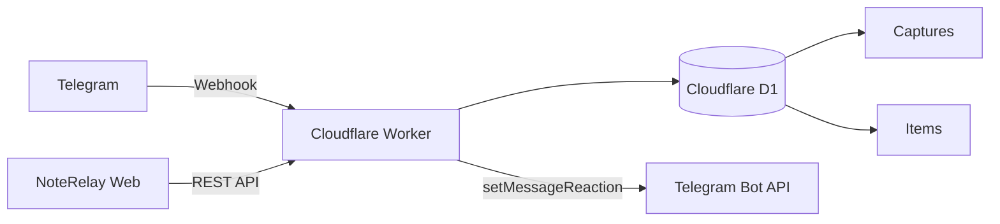
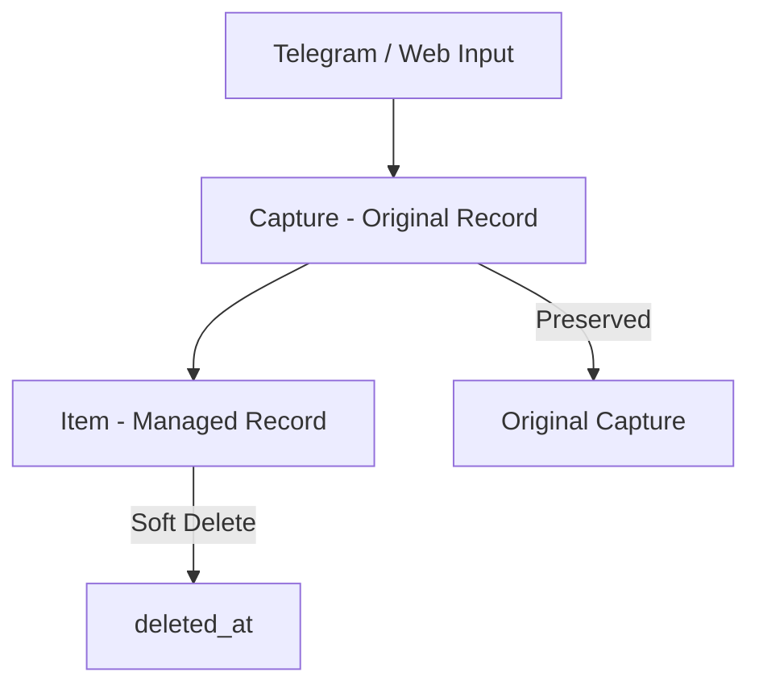

# NoteRelay

> Telegram으로 빠르게 기록하고, Web에서 정리하는 개인용 메모 수집 시스템.

NoteRelay는 생각난 내용을 Telegram으로 즉시 저장하고, 이후 웹 인터페이스에서 확인하고 관리하기 위한 개인용 Capture & Notes 시스템입니다.

Telegram은 **빠른 입력 인터페이스**, Web은 **관리 인터페이스**, Cloudflare D1은 **단일 데이터 저장소** 역할을 합니다.

---

## Features

### Telegram Capture

- Telegram Bot을 이용한 빠른 메모 저장
- Cloudflare Worker 기반 Webhook 처리
- 허용된 Telegram 사용자만 Capture 가능
- Webhook Secret 검증
- 동일 Telegram 메시지 중복 저장 방지
- 저장 성공 시 원본 메시지에 👍 Reaction
- Reaction 실패가 저장을 rollback하지 않는 best-effort 구조

### Web Workspace

- Inbox 목록
- Quick Capture
- 저장 버튼 기반 명시적 저장
- Enter / Shift+Enter 줄바꿈
- Inbox Item soft delete
- 삭제 후에도 원본 Capture 보존
- Responsive desktop/mobile UI

---

## Architecture



NoteRelay는 입력 원본인 **Capture**와 실제 관리 대상인 **Item**을 분리합니다.



Item을 삭제해도 Capture 원본은 삭제하지 않습니다.

---

## Tech Stack

### Frontend

- React
- TypeScript
- Vite
- TanStack Query
- GitHub Pages

### Backend

- Cloudflare Workers
- Hono
- TypeScript

### Database

- Cloudflare D1
- SQLite-compatible schema

### Integration

- Telegram Bot API
- Telegram Webhook
- `setMessageReaction`

---

## Project Structure

```text
tg-note-agent-web/
├─ web/                # React + Vite frontend
├─ worker/             # Cloudflare Worker / Hono API
│  └─ src/
│     └─ services/
│        └─ telegram.ts
├─ shared/             # Shared TypeScript types
├─ migrations/         # Cloudflare D1 migrations
├─ docs/               # Project notes / handoff
├─ .github/
│  └─ workflows/       # GitHub Pages deployment
└─ package.json
```

---

## Development

### Requirements

- Node.js 24+
- npm
- Cloudflare Wrangler

Install dependencies:

```bash
npm install
```

### Web

```bash
npm run dev:web
```

### Worker

```bash
npm run dev:worker
```

### Validation

```bash
npm run build:web
npm run typecheck:worker
```

---

## API

### Health

```http
GET /health
GET /api/health
```

### List Items

```http
GET /api/items
```

Returns non-deleted Items ordered by newest first.

### Create Item

```http
POST /api/items
Content-Type: application/json

{
  "body": "메모 내용"
}
```

A Capture and corresponding Inbox Item are created together.

### Delete Item

```http
DELETE /api/items/:id
```

Performs a soft delete.

The Item receives `deleted_at`, while the original Capture remains preserved.

### Telegram Webhook

```http
POST /telegram/webhook
```

Telegram requests are validated using the configured webhook secret and allowed user ID.

---

## Environment & Secrets

### Local Worker

Create:

```text
worker/.dev.vars
```

Example:

```env
TELEGRAM_BOT_TOKEN=replace-me
TELEGRAM_WEBHOOK_SECRET=replace-me
TELEGRAM_ALLOWED_USER_ID=123456789
```

`worker/.dev.vars` must never be committed.

### Production

Production secrets are stored using Cloudflare Worker Secrets:

```bash
wrangler secret put TELEGRAM_BOT_TOKEN
wrangler secret put TELEGRAM_WEBHOOK_SECRET
wrangler secret put TELEGRAM_ALLOWED_USER_ID
```

Actual Bot Tokens and secrets must never be stored in Git.

---

## Database

The initial D1 schema contains entities including:

- `captures`
- `items`
- `projects`
- `attachments`
- `item_revisions`
- `tags`
- `item_tags`

Apply migrations locally:

```bash
wrangler d1 migrations apply DB --local --config worker/wrangler.jsonc
```

Apply migrations to production:

```bash
wrangler d1 migrations apply DB --remote --config worker/wrangler.jsonc
```

---

## Deployment

### Cloudflare Worker

Production API:

```text
https://tg-note-agent-web-api.junuh145858.workers.dev
```

### GitHub Pages

The frontend is deployed through GitHub Actions whenever `main` is pushed.

Production URL:

```text
https://transient-onlooker.github.io/tg-note-agent-web/
```

Vite base path:

```text
/tg-note-agent-web/
```

Production builds use:

```env
VITE_API_BASE_URL=https://tg-note-agent-web-api.junuh145858.workers.dev
```

---

## Telegram Flow

```text
Telegram message
       ↓
Telegram Bot
       ↓
Cloudflare Worker Webhook
       ↓
Validate webhook secret
       ↓
Validate allowed user
       ↓
Check duplicate message
       ↓
Create Capture
       ↓
Create Inbox Item
       ↓
Cloudflare D1
       ↓
👍 Reaction
```

A normal Telegram Capture does not require a Raspberry Pi or an always-on personal computer.

---

## V0 Status

Currently implemented:

- [x] React + Vite Web UI
- [x] Cloudflare Worker API
- [x] Cloudflare D1 production database
- [x] Web Quick Capture
- [x] Inbox
- [x] Soft Delete
- [x] Capture preservation
- [x] Telegram Webhook
- [x] Telegram user validation
- [x] Webhook secret validation
- [x] Telegram duplicate protection
- [x] Telegram → D1 Capture
- [x] Successful Capture → 👍 Reaction
- [x] Production Worker deployment
- [ ] GitHub Pages production deployment verification
- [ ] Web API authentication

---

## Roadmap

Possible future additions:

- Today view
- Projects
- Search
- Item editing
- Tasks and due dates
- Print Queue
- Purchase tracking
- Attachments
- OCR
- AI-assisted classification
- AI search and summarization
- Revision / Trash UI

AI is intended to assist organization and retrieval rather than becoming a requirement for basic Capture.

---

## Security

Telegram Capture currently uses:

- Telegram webhook secret verification
- Allowed Telegram user verification
- Cloudflare Worker Secrets

No Bot Token, API key, or webhook secret should ever be committed to Git.

> Web API authentication should be added before sensitive personal data is exposed through a public production frontend.

---

## License

This repository is currently maintained primarily as a personal project.

An explicit license can be added later if the project is opened for public reuse or distribution.
