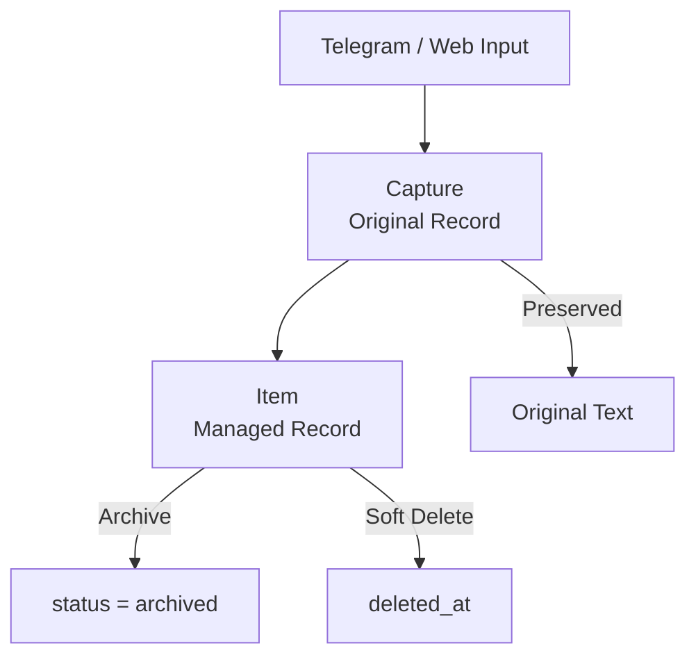
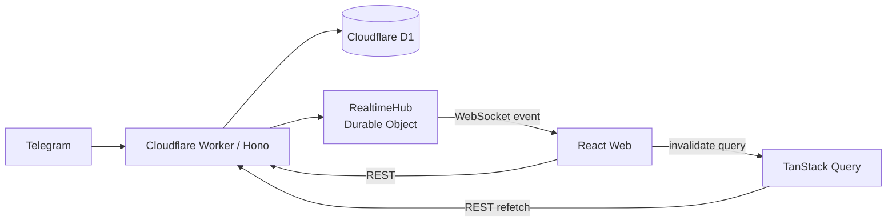

# NoteRelay

> Telegram으로 빠르게 기록하고, Web에서 정리하는 개인용 Capture & Workspace 시스템.

NoteRelay는 생각난 내용을 **Telegram에서 즉시 Capture**하고, 이후 **Web Workspace에서 메모·할 일·구매 항목·3D 프린트 작업 등을 관리**하기 위한 개인용 도구입니다.

핵심 원칙은 단순합니다.

- **Telegram** = 가장 빠른 입력 UI
- **Web** = 실제 정리·관리 Workspace
- **Cloudflare Worker** = API / Telegram integration
- **Cloudflare D1** = 단일 데이터 원본(Source of Truth)
- **Durable Object WebSocket** = 변경 알림
- **AI** = 향후 검색·요약·분류를 돕는 보조 기능이며, 기본 데이터 흐름의 필수 요소가 아님

---

## Current Status

### 구현됨

- Telegram Capture → D1 저장
- Web Quick Capture
- Access Key 기반 Web API 인증
- WebSocket 기반 실시간 갱신
- Inbox
- Notes
- Todo
- Today + Overdue
- Due date/time 직접 편집
- Purchase 기본 분류
- Print Queue 독립 Workspace
- Archive
- Trash / Restore
- Sidebar item count
- Soft Delete + Capture 원본 보존
- GitHub Pages 자동 배포
- Cloudflare Worker 자동 배포

### 다음 작업

- 일반 Item 편집 optimistic UX / rollback 개선
- 일반 카드의 명시적 `Todo로 이동` 액션
- Print Queue compact row 회귀 수정
- Print Queue 편집 셀 자동 높이 확장
- Print Queue 모델 링크 클릭 처리
- Snackbar Undo
- Purchase `전체 / 국내 / 해외` 분류 + 상품 링크
- Projects Workspace
- Telegram `/print` structured command
- Search
- `궁금증` 분류/Workspace

---

## Features

### Telegram Capture

Telegram은 NoteRelay의 **빠른 입력 전용 인터페이스**입니다.

- Telegram Bot Webhook 기반 Capture
- 허용된 Telegram 사용자만 저장 가능
- Webhook Secret 검증
- 동일 Telegram 메시지 중복 저장 방지
- 원문을 `captures`에 보존
- 관리용 `items` 레코드를 별도로 생성
- 저장 성공 시 원본 메시지에 👍 Reaction
- Reaction 실패는 저장을 rollback하지 않는 best-effort 처리

기본 Telegram 메시지는 `kind=inbox`, `status=active` Item으로 생성됩니다.

```text
Telegram message
       ↓
Cloudflare Worker
       ↓
Webhook / user validation
       ↓
Capture 저장
       ↓
Inbox Item 생성
       ↓
Cloudflare D1
       ↓
Realtime broadcast
       ↓
👍 Reaction
```

---

### Web Workspace

Web은 NoteRelay의 실제 관리 화면입니다.

현재 Navigation:

```text
Workspace
├─ Inbox
├─ Todo
├─ Today
└─ Notes

Collections
├─ Projects        # UI 개발 예정
├─ Print Queue
└─ Purchase

Library
├─ Archive
└─ Trash
```

#### Inbox

새로 들어온 기본 Item(`kind=inbox`)을 확인하고 다른 종류로 정리하는 공간입니다.

주요 흐름:

- Quick Capture
- Notes로 분류
- Today로 지정
- Purchase로 분류
- Print Queue로 이동
- Archive
- Soft Delete

#### Todo

`kind=task`, `status=active`인 **전체 미완료 Task**를 보여줍니다.

Todo는 날짜가 없어도 존재할 수 있습니다.

#### Today

Today는 Todo와 별도 데이터 저장소가 아닙니다.

- `kind=task`
- `status=active`
- `due_at`이 존재
- 브라우저 로컬 날짜 기준으로 오늘까지 도래한 Task

화면에서는 다음 두 영역으로 나눕니다.

- **기한 지남(Overdue)** — 오늘보다 이전 due
- **Today** — 오늘 due

날짜가 자정에 넘어가면 로컬 midnight timer가 날짜 경계와 Query를 갱신합니다.

Overdue Item의 원래 `due_at`은 자동 변경하지 않으며, 필요하면 사용자가 직접 오늘로 미룰 수 있습니다.

#### Notes

정리된 일반 메모(`kind=note`)를 관리합니다.

#### Purchase

현재는 `kind=purchase` Item을 모아보는 기본 Workspace입니다.

향후:

- 전체 / 국내 / 해외
- 상품 URL
- 구매 상태/메타데이터

를 추가할 예정입니다.

#### Archive

Archive는 삭제와 다릅니다.

- Archive: `status=archived`
- Trash: `deleted_at IS NOT NULL`

보관 Item은 복원할 수 있습니다.

#### Trash

삭제는 hard delete가 아니라 **soft delete**입니다.

Item에 `deleted_at`을 기록하고, 원본 Capture는 유지합니다.

Trash에서 Item을 복원할 수 있습니다.

---

## Print Queue

Print Queue는 Notes의 필터 화면이 아니라, **3D 프린트 출력 요청/작업을 관리하는 독립 Workspace**입니다.

Item은 `kind=print_job`을 사용하며 별도 `print_jobs` 테이블을 만들지 않습니다.

### Fields

Print Queue의 구조화된 값은 `items.properties_json`에 저장합니다.

| 필드 | 의미 |
|---|---|
| `customer` | 의뢰인 |
| `colors` | 색상 |
| `grams` | 무게 |
| `price` | 금액 |
| `payment` | 입금 정보 |
| `queue_status` | 출력 Queue 상태 |
| `model_url` | 모델 링크 |
| `note` | 비고 |

출력물 이름은 현재 **`items.body`를 단일 기준**으로 사용합니다.

### Queue Status

Print Queue의 작업 상태와 Item lifecycle 상태는 분리합니다.

`properties_json.queue_status`:

- 값 없음 → `미상`
- `waiting` → 대기
- `printing` → 출력중
- `done` → 완료
- `paused` → 보류

`items.status`는 `active`, `archived` 같은 **Item lifecycle** 용도입니다.

### Ordering

Print Queue는 `items.position`을 실제 Queue 순서로 사용합니다.

```text
position ASC
→ created_at ASC
→ id ASC
```

- 새 Print Job은 현재 active Queue의 마지막 `position + 1`
- 위/아래 버튼으로 순서 이동
- 이동 후 필요한 Item의 `position`을 PATCH
- 모바일에서도 동일 기능 제공

### Inline Editing

Spreadsheet 형태로 셀을 직접 편집할 수 있습니다.

- Blur → 저장
- Enter → 저장
- Tab / Shift+Tab → 저장 후 다음/이전 셀 이동
- Escape → 취소
- 값이 바뀌지 않으면 PATCH 생략
- Blur + Enter 중복 PATCH 방지
- 실패 시 서버 값으로 복구 + 오류 피드백

---

## Capture와 Item 분리

NoteRelay에서 **Capture는 원본**, **Item은 관리 대상**입니다.



이 구조 덕분에 Item을 수정·분류·삭제해도 입력 원문을 별도로 보존할 수 있습니다.

---

## Realtime Architecture

D1이 항상 Source of Truth이고 Durable Object는 데이터 저장소가 아니라 **변경 알림 허브**로 사용합니다.



Mutation 흐름:

```text
Web / Telegram mutation
        ↓
D1 update
        ↓
RealtimeHub broadcast
        ↓
WebSocket event
        ↓
TanStack Query invalidate
        ↓
REST refetch
        ↓
D1 최신 상태 반영
```

WebSocket 연결 후 Web은 첫 메시지로 Access Key를 전달합니다.

```json
{
  "type": "auth",
  "token": "<access-key>"
}
```

---

## Authentication & Security

### Web API

`/api/*`는 Bearer Access Key로 보호됩니다.

```http
Authorization: Bearer <WEB_API_TOKEN>
```

Web에서 입력한 Access Key는 선택에 따라 `sessionStorage` 또는 `localStorage`에 저장됩니다.

인증이 만료되거나 `401`이 반환되면 저장된 Access Key를 제거하고 다시 잠금 화면으로 전환합니다.

### Telegram

Telegram Capture는 다음을 검증합니다.

- `TELEGRAM_WEBHOOK_SECRET`
- `TELEGRAM_ALLOWED_USER_ID`
- Telegram message duplicate

Bot Token, API Token, Webhook Secret 등 실제 Secret은 Git에 커밋하지 않습니다.

---

## Tech Stack

### Frontend

- React 19
- TypeScript
- Vite
- TanStack Query
- Oxlint
- GitHub Pages

### Backend

- Cloudflare Workers
- Hono
- TypeScript
- Wrangler

### Data / Realtime

- Cloudflare D1
- Durable Objects
- WebSocket

### Integration

- Telegram Bot API
- Telegram Webhook
- `setMessageReaction`

---

## Project Structure

```text
tg-note-agent-web/
├─ web/
│  ├─ src/
│  │  ├─ api/             # REST auth/items API client
│  │  ├─ components/      # App shell / shared UI
│  │  ├─ config/          # Navigation
│  │  ├─ utils/           # Date helpers
│  │  ├─ views/           # Inbox, Todo, Today, Notes, Print Queue...
│  │  ├─ App.tsx
│  │  └─ realtime.ts      # WebSocket → Query invalidation
│  └─ vite.config.ts
│
├─ worker/
│  ├─ src/
│  │  ├─ services/
│  │  │  ├─ realtime.ts
│  │  │  └─ telegram.ts
│  │  └─ index.ts         # Hono routes / D1 mutations
│  └─ wrangler.jsonc
│
├─ shared/
│  └─ src/                # Shared Item / Project / Print Job types
│
├─ migrations/
│  └─ 0001_initial.sql
│
├─ docs/
│  ├─ API.md
│  ├─ DEVELOPMENT_FLOW.md
│  └─ HANDOFF.md
│
├─ .github/workflows/
│  ├─ deploy-worker.yml
│  └─ pages-v2.yml
│
└─ package.json
```

---

## Data Model

초기 D1 schema에는 다음 entity가 있습니다.

- `captures`
- `items`
- `projects`
- `attachments`
- `item_revisions`
- `tags`
- `item_tags`

### Item

주요 필드:

```text
id
capture_id
parent_id
project_id
kind
status
title
body
due_at
properties_json
position
triaged_at
created_at
updated_at
deleted_at
version
```

현재 사용되는 주요 `kind`:

```text
inbox
note
task
purchase
print_job
reference
```

Projects table과 `items.project_id`는 schema에 이미 존재하지만 Projects Workspace는 아직 개발 예정입니다.

---

## API Overview

모든 `/api/*` 요청은 Access Key 인증이 필요합니다.

### Health

```http
GET /health
GET /api/health
```

`/health`는 Worker 상태 확인용이며 `/api/health`는 Access Key 검증에도 사용됩니다.

### Items

```http
GET /api/items
GET /api/items?kind=task&status=active
GET /api/items?due_from=<ISO>&due_to=<ISO>

POST /api/items
PATCH /api/items/:id
DELETE /api/items/:id
POST /api/items/:id/restore
```

지원하는 주요 필터:

- `kind`
- `status`
- `project_id`
- `due_from`
- `due_to`

### Sidebar Counts

```http
GET /api/counts?today_to=<ISO>
```

Web이 브라우저 로컬 기준 **다음날 00:00**을 ISO로 계산해 `today_to`로 전달하고, Worker는 하나의 aggregate query로 Sidebar count를 계산합니다.

### Trash

```http
GET /api/trash
```

### Telegram

```http
POST /telegram/webhook
```

### Realtime

```http
GET /ws
```

WebSocket 연결 후 Access Key 인증 메시지를 전송합니다.

---

## Local Development

### Requirements

- Node.js 24+
- npm
- Cloudflare account / Wrangler login (remote D1 또는 deploy 시)

### Install

```bash
npm install
```

### Worker Environment

`worker/.dev.vars`를 생성합니다.

```env
TELEGRAM_BOT_TOKEN=replace-me
TELEGRAM_WEBHOOK_SECRET=local-test-secret
TELEGRAM_ALLOWED_USER_ID=123456789
WEB_API_TOKEN=replace-me
```

`worker/.dev.vars`는 Git에 커밋하지 않습니다.

### Run Worker

```bash
npm run dev:worker
```

기본 local API:

```text
http://127.0.0.1:8787
```

### Run Web

다른 터미널에서:

```bash
npm run dev:web
```

`VITE_API_BASE_URL`이 없으면 Web은 기본적으로 `http://127.0.0.1:8787`을 사용합니다.

필요하면 `web/.env.local`에 지정할 수 있습니다.

```env
VITE_API_BASE_URL=http://127.0.0.1:8787
```

---

## Database

### Local migration

```bash
npx wrangler d1 migrations apply DB --local --config worker/wrangler.jsonc
```

### Production migration

```bash
npx wrangler d1 migrations apply DB --remote --config worker/wrangler.jsonc
```

D1이 NoteRelay의 단일 Source of Truth입니다.

---

## Validation

주요 변경 후 다음 검증을 권장합니다.

```bash
npm run typecheck:worker
npm run build:web
npm run lint --workspace web
git diff --check
```

---

## Deployment

### Web — GitHub Pages

`main` push 시 GitHub Actions가 Web을 build하고 GitHub Pages에 배포합니다.

Production Web:

```text
https://transient-onlooker.github.io/tg-note-agent-web/
```

Vite base path:

```text
/tg-note-agent-web/
```

Production build API URL:

```text
https://tg-note-agent-web-api.junuh145858.workers.dev
```

### Worker — Cloudflare Workers

Worker 관련 경로가 `main`에 push되면 GitHub Actions가 자동 배포합니다.

Production Worker:

```text
https://tg-note-agent-web-api.junuh145858.workers.dev
```

GitHub Actions repository secrets:

```text
CLOUDFLARE_API_TOKEN
CLOUDFLARE_ACCOUNT_ID
```

수동 배포:

```bash
npm run deploy --workspace worker
```

Worker runtime secrets는 Cloudflare에 별도로 등록합니다.

```bash
npx wrangler secret put TELEGRAM_BOT_TOKEN --config worker/wrangler.jsonc
npx wrangler secret put TELEGRAM_WEBHOOK_SECRET --config worker/wrangler.jsonc
npx wrangler secret put TELEGRAM_ALLOWED_USER_ID --config worker/wrangler.jsonc
npx wrangler secret put WEB_API_TOKEN --config worker/wrangler.jsonc
```

---

## Product Direction

NoteRelay는 범용 문서 편집기나 Notion clone을 목표로 하지 않습니다.

우선순위는 다음과 같습니다.

1. **Capture가 빨라야 한다.**
2. **원본 데이터가 안전해야 한다.**
3. **Web에서 분류와 관리가 명확해야 한다.**
4. **구조는 가능한 한 기존 `items` 중심으로 단순하게 유지한다.**
5. **AI가 없어도 모든 핵심 기능이 동작해야 한다.**
6. **AI는 검색·요약·분류 제안의 assistant 역할만 한다.**

현재 Print Queue처럼 도메인별 구조화 데이터가 필요할 때도 먼저 `items + properties_json` 조합을 사용하고, 별도 테이블은 실제 필요성이 확인된 뒤 추가합니다.

---

## Roadmap

### Near Term

- Item edit optimistic update / rollback
- Todo 이동 UX 정리
- Print Queue row / inline editing UX polish
- Print Queue model URL link
- Undo snackbar
- Purchase 국내/해외 + 상품 링크

### Next

- Projects folder-style Workspace
- Telegram `/print` structured command
- Search
- `궁금증` Workspace
- Sidebar / mobile UX refinement

### Later

- Item revisions 활용
- Attachments
- Multi-line Capture split UI
- AI-assisted classification suggestions
- AI search / summarization

AI가 Item을 임의로 수정하거나 자동으로 DB mutation하는 구조는 기본 방향이 아닙니다.

---

## License

이 저장소는 현재 개인 프로젝트로 관리되고 있습니다.

외부 재사용을 위한 명시적 라이선스는 필요 시 추후 추가할 수 있습니다.
