# NoteRelay Development Flow

> Repository: `Transient-Onlooker/tg-note-agent-web`
>
> 이 문서는 NoteRelay의 실제 구현 상태, `main` 중심 개발 이력, 검증 및 릴리스 흐름을 기록한다.
> 문서보다 현재 코드와 Git 상태가 우선한다.

---

## 1. Product Evolution

버전 진화는 시간 순서를 표현하는 `timeline`으로 관리한다.

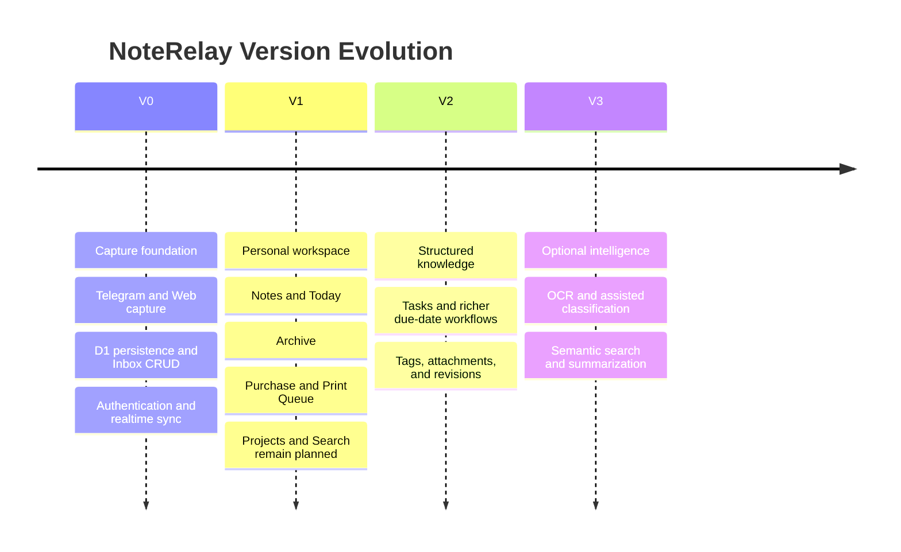

버전 경계는 실제 사용 경험과 우선순위에 따라 조정할 수 있다.

---

## 2. Current V1 Status

상태 전이는 구현 완료, 현재 진행, 예정의 경계를 명확히 표현한다.

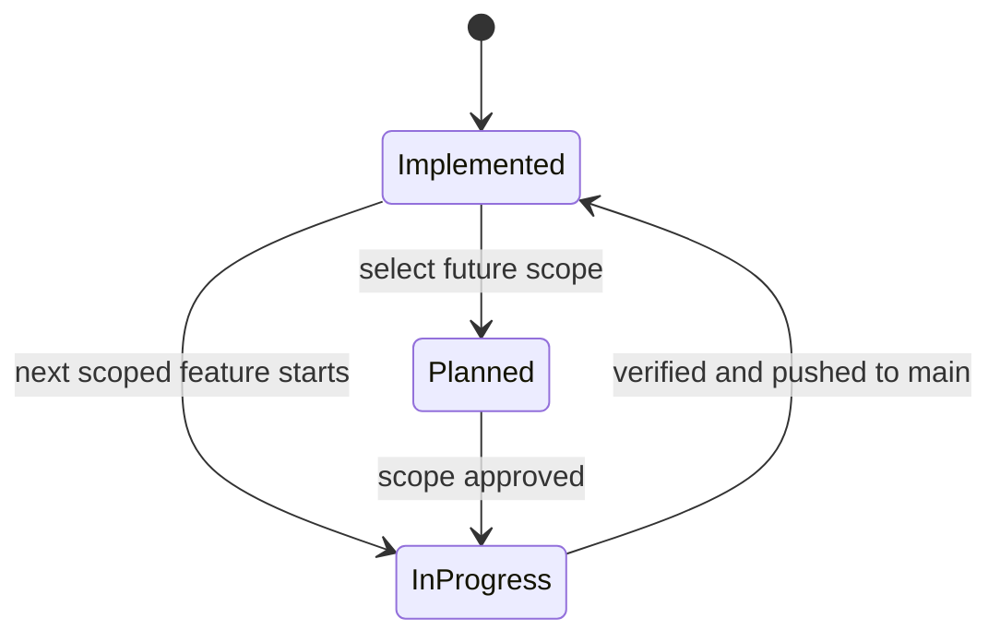

| 상태 | 기능 | 근거 |
|---|---|---|
| 구현 완료 | Notes | `a899e20 Implement Notes sidebar workflow` |
| 구현 완료 | Archive | `dee5b82 Implement Archive sidebar workflow` |
| 구현 완료 | Purchase | `5a1c857 Implement Purchase sidebar workflow` |
| 구현 완료 | Print Queue | `ac892d7 Implement Print Queue sidebar workflow` |
| 구현 완료 | Today | `9d814f2 Implement Today sidebar workflow` |
| 진행 중 | 없음 | 현재 working tree 기준 |
| 예정 | Projects, Search | 아직 실제 View 구현 없음 |

현재 V1의 공통 기반:

- `listItems(filters)` 기반 filtered query
- `updateItemFields(id, input)` 기반 Item 분류 및 상태 변경
- 안정적인 `itemQueryKeys` prefix와 TanStack Query invalidation
- WebSocket 변경 알림 후 D1 REST API 재조회
- 공통 edit, soft delete, Trash/Restore, Archive 동작

---

## 3. Current Architecture

컴포넌트와 데이터 경로를 표현하므로 `flowchart`를 유지한다.

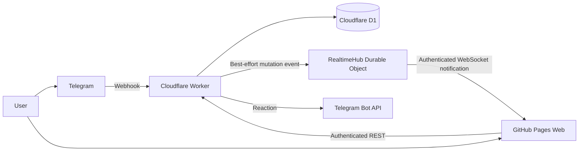

운영 원칙:

- D1이 데이터의 single source of truth다.
- WebSocket은 변경 알림만 전송하고 전체 Item 상태를 전달하지 않는다.
- Realtime 장애가 성공한 D1 mutation을 실패로 바꾸지 않는다.
- Telegram과 Web API는 서로 다른 인증 경로를 유지한다.

---

## 4. Core Data Model

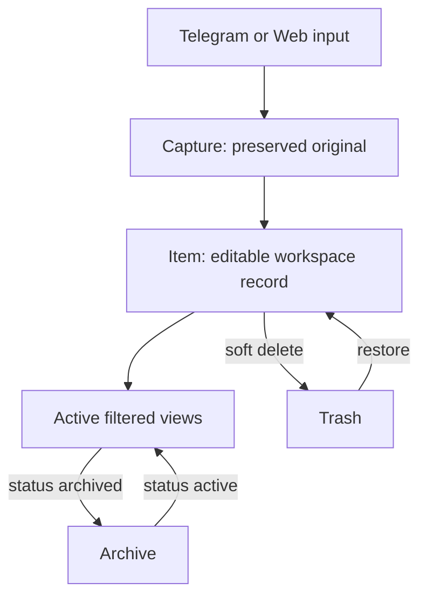

- Capture 원본은 보존한다.
- Item은 body, kind, status, due date 등 관리 가능한 상태를 가진다.
- Notes, Purchase, Print Queue는 `kind` filtered view다.
- Today는 로컬 날짜 범위의 `due_at` filtered view다.
- Archive는 `status = archived`, Trash는 `deleted_at IS NOT NULL`로 구분한다.

---

## 5. Capture and Mutation Data Flow

### Telegram Capture

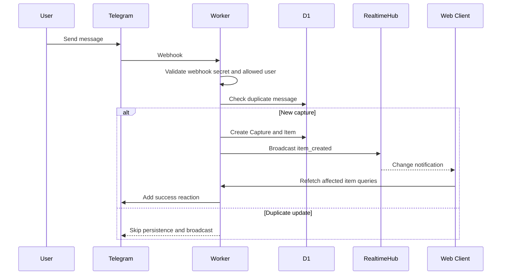

### Web Mutation

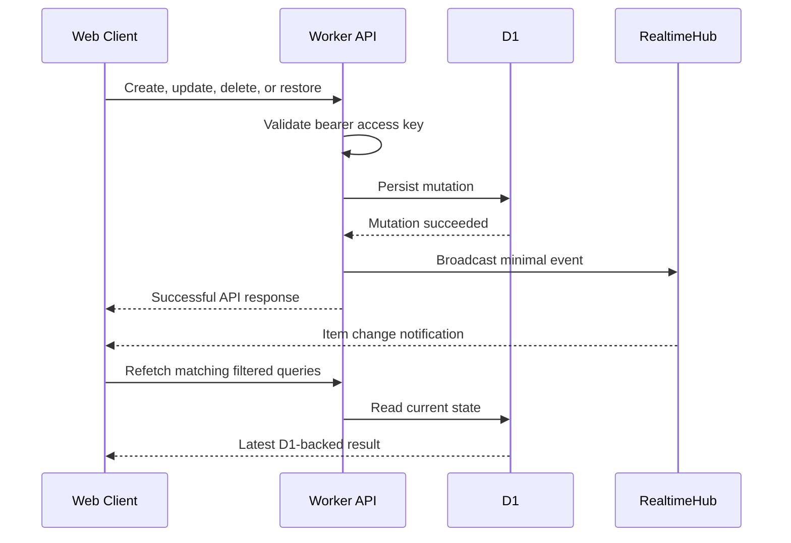

---

## 6. Workspace View Rules

| View | Query | Move in | Move out |
|---|---|---|---|
| Inbox | `kind = inbox`, `status = active` | default capture or return action | change `kind`, archive, or soft delete |
| Notes | `kind = note`, `status = active` | `kind = note` | `kind = inbox`, archive, or soft delete |
| Purchase | `kind = purchase`, `status = active` | `kind = purchase` | `kind = inbox`, archive, or soft delete |
| Print Queue | `kind = print_job`, `status = active` | `kind = print_job` | `kind = inbox`, archive, or soft delete |
| Today | `status = active`, local `[00:00, next 00:00)` due range | set `due_at` to today | clear `due_at`, archive, or soft delete |
| Archive | `status = archived` | `status = archived` | `status = active` or soft delete |
| Trash | `deleted_at IS NOT NULL` | soft delete | restore |

모든 active Item view는 `itemQueryKeys`의 `items` prefix 아래에 안정적인 filter key를 사용한다. Mutation 성공 시 관련 cache를 즉시 반영하고 item query prefix를 invalidate한다.

---

## 7. Actual Main Development History

이 그래프는 `git log --oneline --decorate origin/main`에서 확인한 실제 `main` 커밋만 포함한다. 존재하지 않는 develop/release branch는 표현하지 않는다.

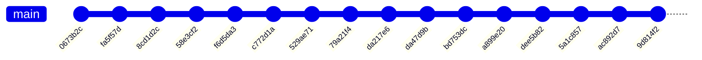

최근 V1 흐름:

1. `bd753dc` — filtered item query/update foundation
2. `a899e20` — Notes
3. `dee5b82` — Archive
4. `5a1c857` — Purchase
5. `ac892d7` — Print Queue
6. `9d814f2` — Today

---

## 8. Development Process

작업 절차는 의사결정과 반복을 표현하므로 `flowchart`가 적합하다.

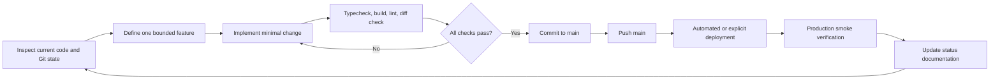

Commit, push, production deployment는 해당 작업에서 명시적으로 허용된 경우에만 수행한다.

---

## 9. Feature Lifecycle

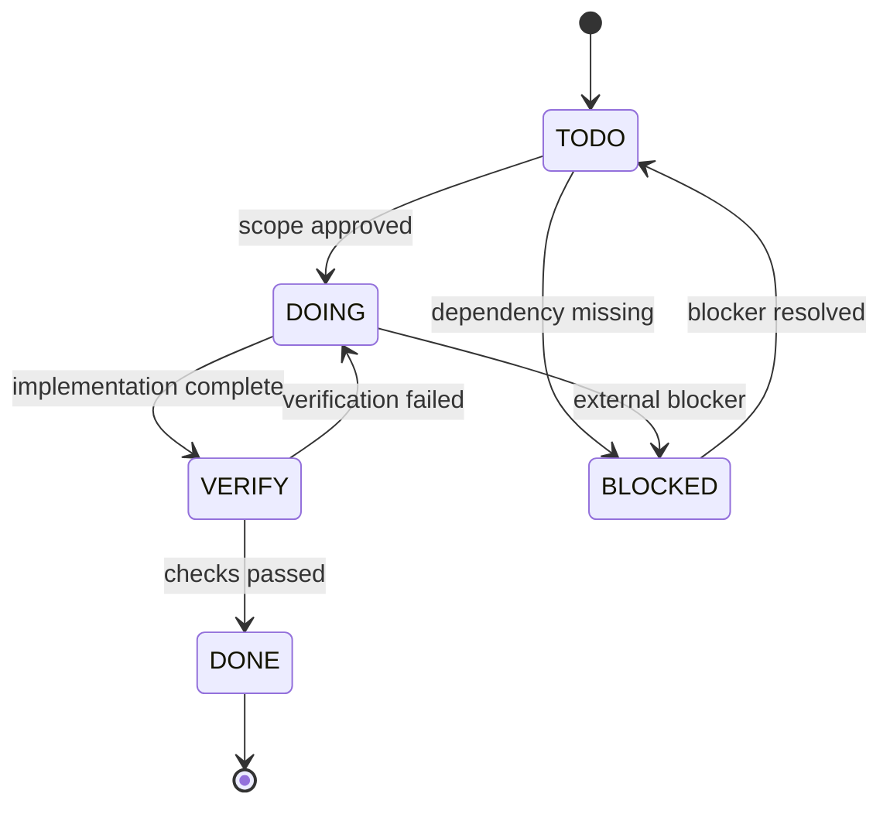

| 상태 | 정의 |
|---|---|
| `TODO` | 범위는 알려졌지만 구현을 시작하지 않음 |
| `DOING` | 코드 또는 문서 변경 진행 중 |
| `VERIFY` | 구현 완료 후 검증 중 |
| `DONE` | 구현, 검증, Git 상태 반영 완료 |
| `BLOCKED` | 외부 조건 없이는 진행 불가 |

---

## 10. Release Gates

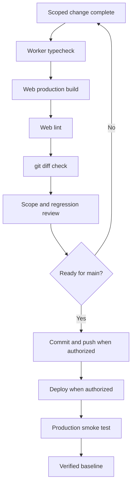

Database migration이 포함될 때만 별도의 migration safety 검증을 추가한다. Realtime 변경이 포함될 때만 WebSocket 연결과 multi-client 동작을 추가 검증한다.

---

## 11. Current Position and Next Scope

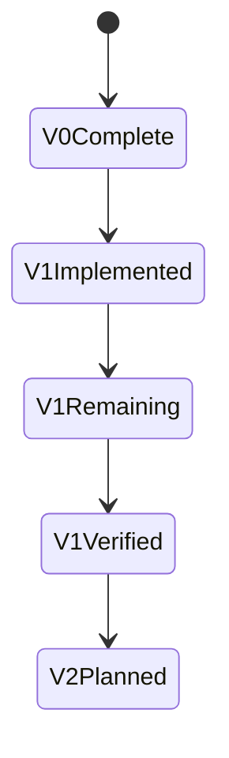

- `V0Complete`: Capture, persistence, auth, CRUD, Trash/Restore, realtime, production baseline
- `V1Implemented`: Notes, Archive, Purchase, Print Queue, Today
- `V1Remaining`: Projects, Search, reliability and UX verification
- `V1Verified`: 남은 V1 범위와 production regression 검증 완료
- `V2Planned`: Tasks, tags, attachments, revisions 등 구조화 기능 검토

---

## 12. Guiding Principles

1. Capture는 빠르고 AI에 의존하지 않아야 한다.
2. Capture 원본은 보존하고 Item만 관리 가능한 상태로 변경한다.
3. D1은 항상 source of truth다.
4. WebSocket은 동기화 신호이며 데이터 저장소가 아니다.
5. 기존 안정 기능은 구체적인 이유 없이 재작성하지 않는다.
6. 기능은 작고 독립적으로 검증 가능한 단위로 구현한다.
7. 문서는 실제 코드, `origin/main`, working tree 상태와 함께 갱신한다.
8. 버전과 roadmap은 실제 사용 결과에 따라 조정한다.
