# NoteRelay Development Flow

> Repository: `Transient-Onlooker/tg-note-agent-web`
>
> Telegram으로 빠르게 Capture하고,
> Web에서 정리·관리하며,
> 이후 검색·프로젝트·자동화·AI까지 확장하는
> 개인용 Capture & Notes 시스템의 개발 지도.
>
> 이 문서는 특정 버전만을 위한 계획이 아니라
> NoteRelay 전체 생명주기를 추적한다.

---

# 1. Product Evolution

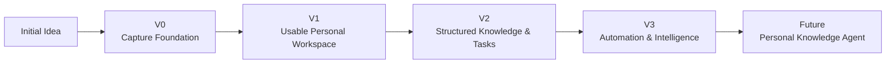

---

# 2. Version Overview

```mermaid
flowchart TB

    subgraph V0["V0 — Capture Foundation"]
        V0A[Telegram Capture]
        V0B[Web Quick Capture]
        V0C[D1 Persistence]
        V0D[Inbox]
        V0E[Edit]
        V0F[Soft Delete]
        V0G[Trash / Restore]
        V0H[Access Key Authentication]
        V0I[Realtime Sync]
        V0J[Production Deployment]
    end

    subgraph V1["V1 — Personal Workspace"]
        V1A[Stable Inbox Workflow]
        V1B[Today View]
        V1C[Projects]
        V1D[Search]
        V1E[Improved Navigation]
        V1F[Error / Empty / Loading UX]
        V1G[Reliability Hardening]
    end

    subgraph V2["V2 — Structured Knowledge"]
        V2A[Tasks]
        V2B[Due Dates]
        V2C[Tags]
        V2D[Attachments]
        V2E[Revision History]
        V2F[Advanced Filtering]
    end

    subgraph V3["V3 — Automation & Intelligence"]
        V3A[OCR]
        V3B[AI Classification]
        V3C[AI Search]
        V3D[Summarization]
        V3E[Automation]
        V3F[Specialized Queues]
    end

    V0 --> V1
    V1 --> V2
    V2 --> V3
```

> V1 이후의 버전 경계는 고정된 계약이 아니다.
> 실제 사용 경험과 우선순위에 따라 기능은 앞뒤 버전으로 이동할 수 있다.

---

# 3. Current Architecture

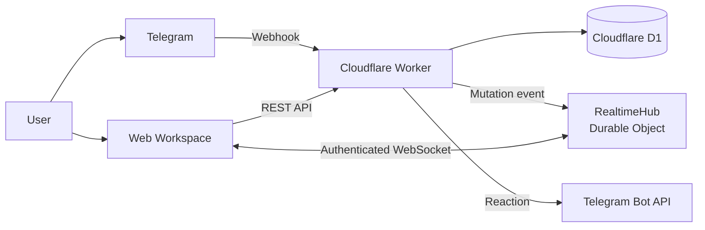

---

# 4. Core Data Model

NoteRelay는 원본 입력과 사용자가 관리하는 데이터를 분리한다.

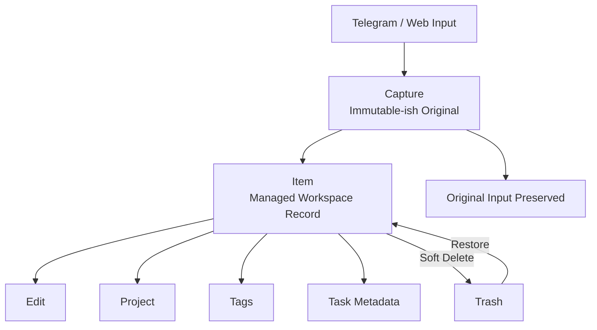

핵심 원칙:

- Capture는 입력 원본을 보존한다.
- Item은 사용자가 정리하고 수정하는 작업 대상이다.
- Item 삭제는 기본적으로 soft delete다.
- 기능 확장 시에도 원본 Capture 보존 원칙을 유지한다.

---

# 5. Data Flow

## Telegram Capture

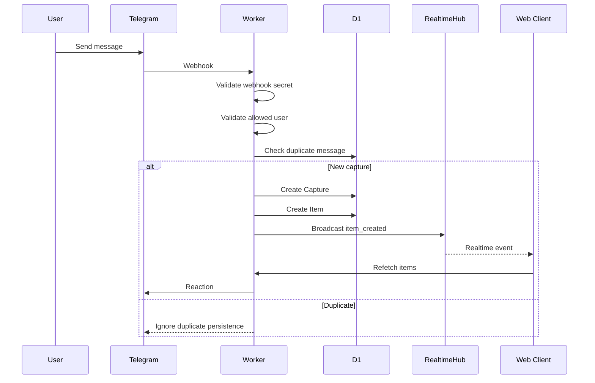

## Web Mutation

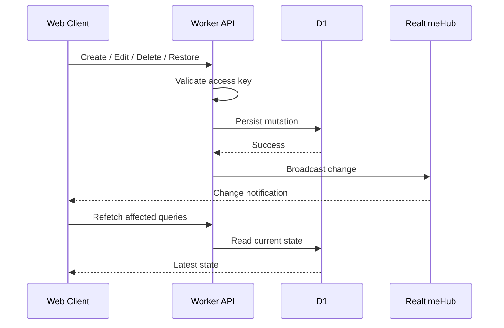

WebSocket의 역할은 데이터 전달 자체가 아니라
**변경 사실을 빠르게 전달하는 notification channel**이다.

---

# 6. V0 — Capture Foundation

V0의 목적:

> Telegram과 Web 어디에서 입력하더라도
> 데이터가 안전하게 D1에 저장되고,
> Web Workspace에서 기본적인 관리가 가능한 상태.

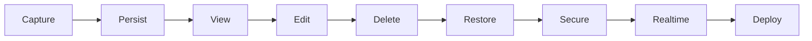

현재 구현된 V0 baseline:

- Telegram Capture
- Telegram webhook validation
- Allowed Telegram user validation
- Duplicate protection
- Capture → Item 생성
- Successful capture reaction
- Web Quick Capture
- Inbox
- Item Editing
- Soft Delete
- Trash
- Restore
- Capture preservation
- Web API Access Key
- Durable Object WebSocket
- Realtime query invalidation
- Cloudflare Worker production deployment
- GitHub Pages deployment

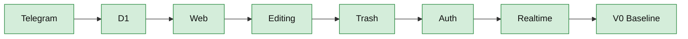

---

# 7. V1 — Personal Workspace

V1의 핵심 목표:

> 단순 Capture 저장소를 넘어,
> 매일 실제로 사용할 수 있는 개인 Workspace로 만든다.

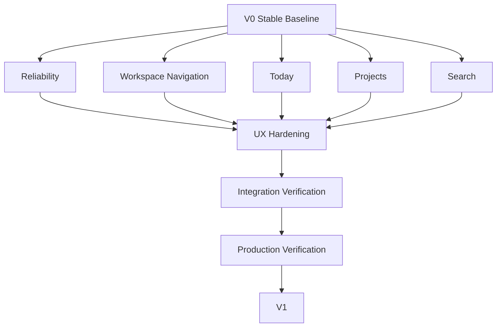

V1 후보 작업 영역:

### Foundation Hardening

- API validation
- Error handling
- Loading states
- Empty states
- WebSocket reconnect handling
- Realtime consistency
- Multi-client behavior
- Duplicate behavior
- Production smoke tests

### Workspace

- Today
- Projects
- Search
- Navigation
- Better item organization
- Mobile usability

### Release Quality

- Build verification
- Worker typecheck
- Database migration safety
- Production API verification
- Pages verification
- Regression verification

---

# 8. V2 — Structured Knowledge & Action

V2부터 Item이 단순 메모를 넘어
구조화된 정보와 행동 단위로 발전한다.

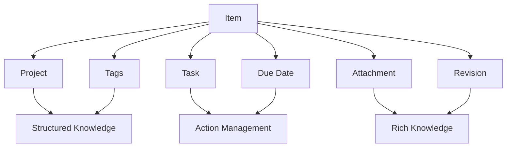

후보 기능:

- Tasks
- Due dates
- Tags
- Attachments
- Revision history
- Advanced filtering
- Archive concepts
- Saved views

---

# 9. V3 — Automation & Intelligence

AI는 Capture의 필수 경로가 아니다.

기본 Capture는 AI 없이도 항상 동작해야 한다.

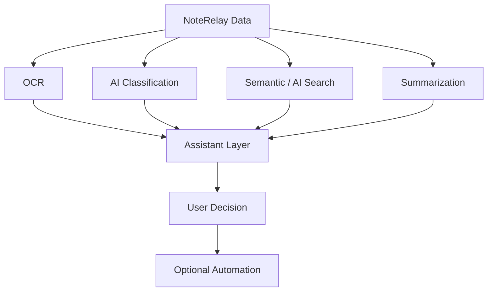

가능한 기능:

- OCR
- Automatic classification
- Suggested projects / tags
- Semantic search
- Summarization
- Related-item discovery
- Natural-language retrieval
- Optional automation

AI 원칙:

> AI는 정리와 검색을 보조한다.
> Capture 자체의 성공 여부는 AI에 의존하지 않는다.

---

# 10. Specialized Workflows

일반 Item 모델 위에 목적별 Queue를 추가할 수 있다.

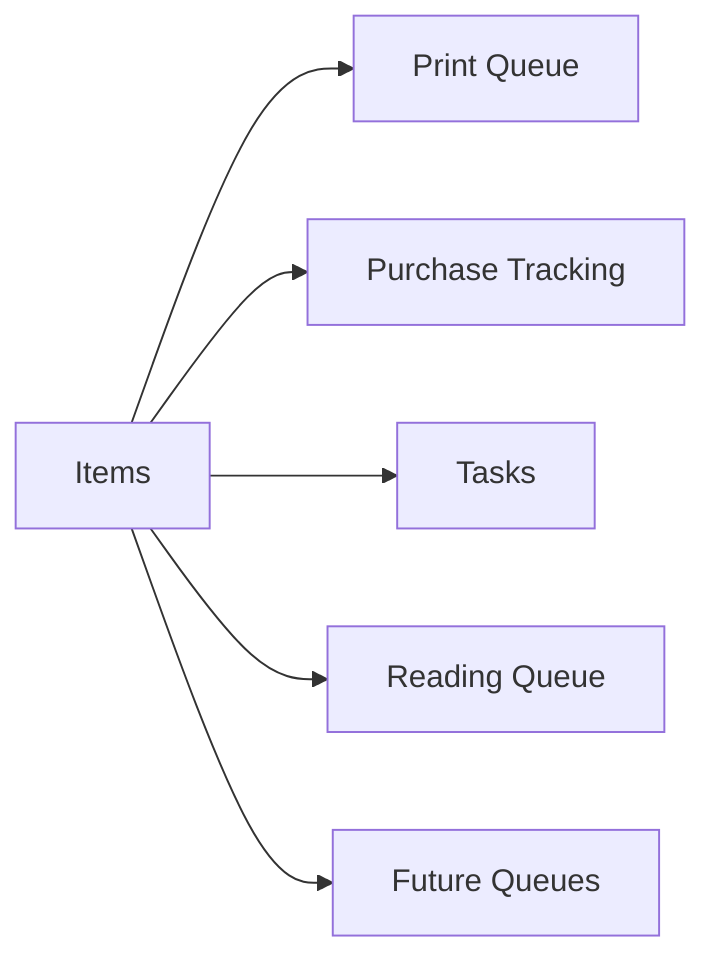

가능한 확장:

- Print Queue
- Purchase Tracking
- Reading Queue
- Waiting / Follow-up Queue
- Custom saved workflows

---

# 11. Development Process

모든 기능 개발은 아래 루프를 따른다.

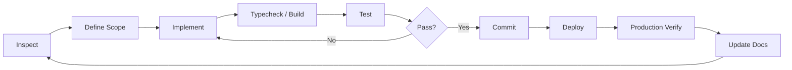

---

# 12. Feature Lifecycle

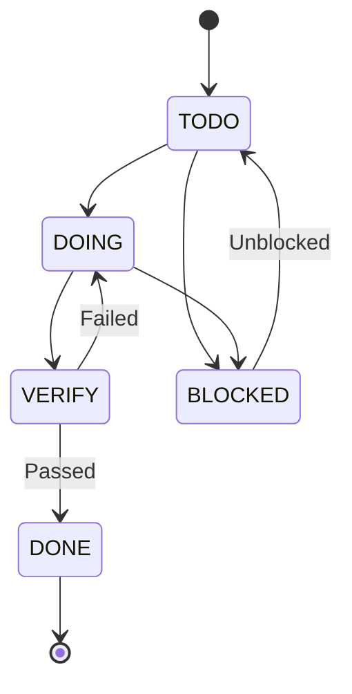

상태 정의:

| Status | Meaning |
|---|---|
| `TODO` | 아직 시작하지 않음 |
| `DOING` | 구현 중 |
| `VERIFY` | 구현 완료, 검증 필요 |
| `DONE` | 구현 + 검증 완료 |
| `BLOCKED` | 외부 조건 또는 선행 작업 필요 |

---

# 13. Release Gates

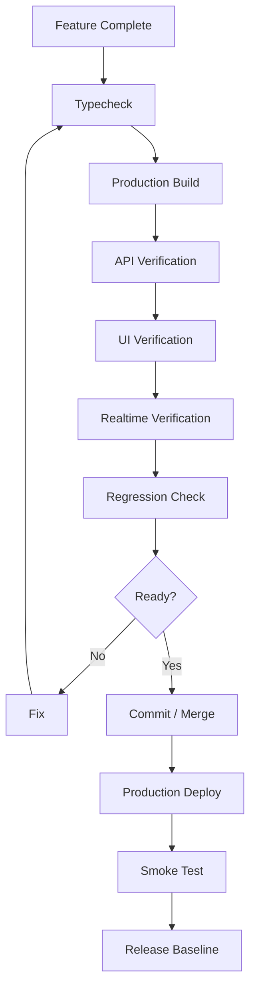

---

# 14. Version Progress

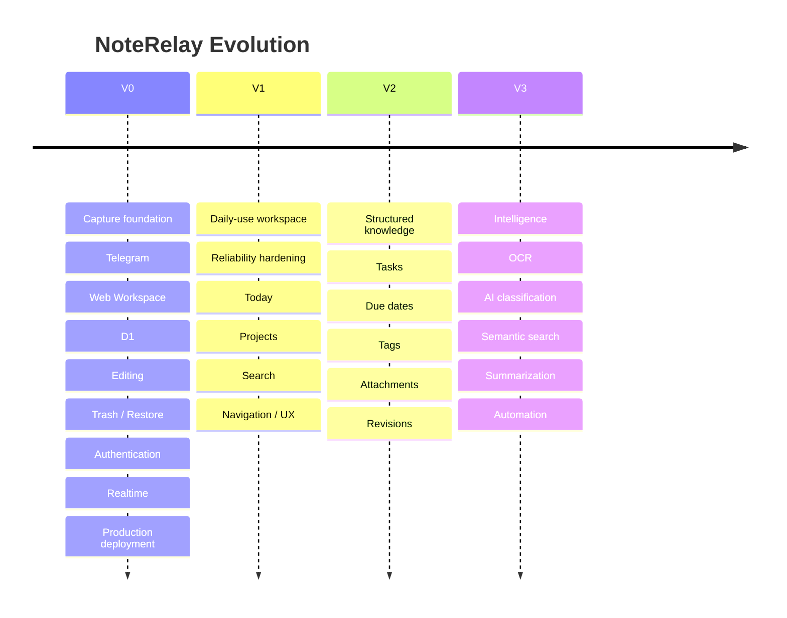

---

# 15. Current Position

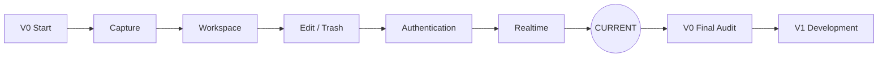

현재 위치:

**V0 기능 구현은 대부분 완료되었고,
V1 개발에 들어가기 전에 현재 baseline을 검증하고 정리하는 단계.**

---

# 16. Immediate Development Flow

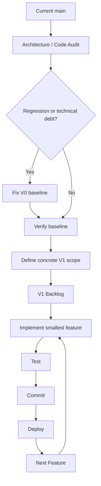

---

# 17. Guiding Principles

1. Capture must remain fast.
2. Original Capture data should be preserved.
3. D1 is the source of truth.
4. WebSocket is a synchronization signal, not the primary datastore.
5. Core Capture must not depend on AI.
6. Features should be implemented in small independently verifiable steps.
7. Production behavior must be verified after meaningful changes.
8. Documentation should evolve with the implementation.
9. Version boundaries may evolve based on actual usage.
10. Existing stable functionality should not be rewritten without a concrete reason.

---

# 18. Roadmap Status

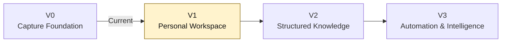

현재 개발 방향:

**V0 baseline 검증 → V1 scope 확정 → V1 기능 개발 → V1 release**

이후 실제 사용 경험을 바탕으로 V2/V3의 범위를 재조정한다.
